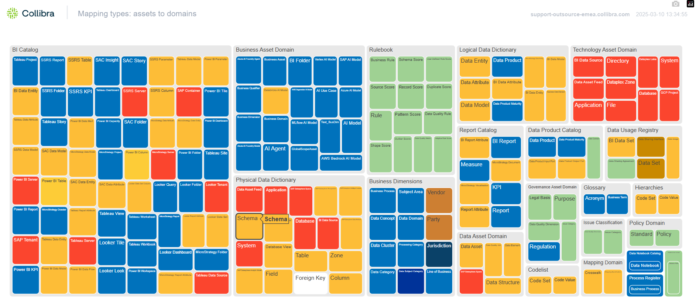
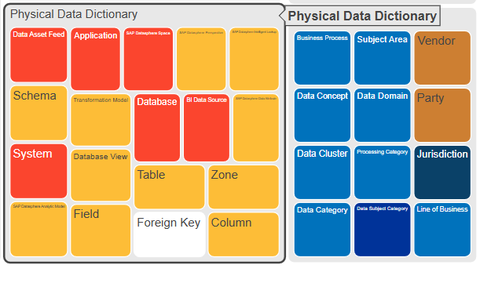
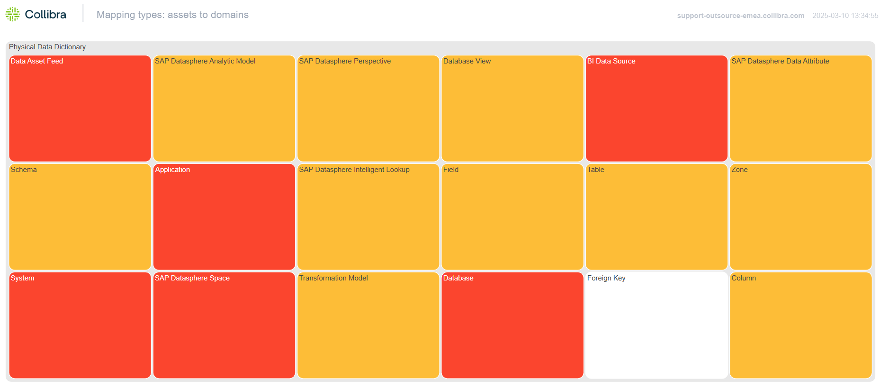
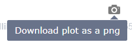

# Collibra Domain and Asset Type Mapping
### What it does?
This project retrieves domain and asset type information from a Collibra instance, writes the data to a JSON file, and visualizes the result using a treemap. Example:


### Why?
This project is useful for understanding the structure of your Collibra instance metamodel and the relationships between domains and asset types. It helps answering such questions as:
- What asset types do I have?
- What domain types are hosting them?
- When a new asset is created (upon ingestion from data source or when created manually) to what type of domain will it go?

The visualization helps you see the big picture and identify areas that need improvement or your special attention. Such feature is currently not available in Collibra.   

### Other features:
In the top-right corner, you can see your instance details:


The treemap is interactive, so you can zoom in and out, and hover over the tiles to see more information:
 

Zooming in shows the asset types within a domain:


Back to the top-right corner, you can click on a photo icon and capture the whole operating model:


### How it is implemented?
The project is implemented in Python and uses the following libraries:
- `requests` for making HTTP requests to the Collibra API
- `json` for handling JSON data
- `plotly` for creating interactive visualizations
- `dotenv` for loading environment variables from a `.env` file
- `logging` for basic logging

First, we make a REST API call to `/rest/2.0/domains` endpoint and build a set of unique domain types available in your instance. Then, for each of these domain types we make another call to `rest/2.0/assignments/domain/{domain_id}/assetTypes` to get the asset types assigned to that domain. The result is a dictionary with domain types as keys and a list of asset types as values. In the same loop you collect asset colors to later use them in visualisation. Finally, you transform this Python dictionary into data frame so that plotly can visualise it as a treemap. 

## Prerequisites

- Python 3.6+
- `pip` (Python package installer)
- `virtualenv` (optional, but recommended)

## Setup

1. Clone the repository:
    ```sh
    git clone https://github.com/yourusername/your-repo-name.git
    cd your-repo-name
    ```

2. Create and activate a virtual environment (optional but recommended):
    ```sh
    python -m venv venv
    source venv/bin/activate  # On Windows use `venv\Scripts\activate`
    ```

3. Install the required packages:
    ```sh
    pip install -r requirements.txt
    ```

4. Create a `.env` file in the root directory of the project and add your Collibra credentials:
    ```env
    COLLIBRA_USERNAME=your_username
    COLLIBRA_PASSWORD=your_password
    ```

## Usage

To run the script and generate the JSON file and visualization, execute:
```sh
python main.py